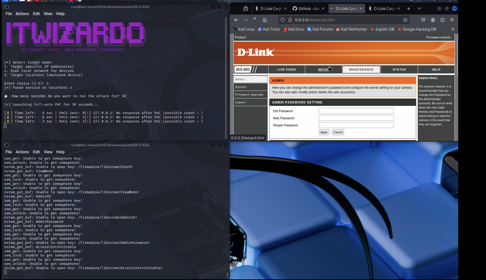

# Make Emulating Easy Again


Welcome! This repository provides tools and an environment to emulate the D-Link DCS-932L firmware and demonstrate the **CVE-2024-37606** vulnerability. It includes pre-patched binaries and necessary libraries, simplifying the emulation setup so you don't need to perform manual patching with tools like Ghidra.

## CVE-2024-37606

This project includes a proof-of-concept exploit (`CVE-2024-37606-DCS932L.py`) for CVE-2024-37606. This vulnerability involves a buffer overflow in the alphapd service. Please use this responsibly and for educational purposes only.
Click on the photo to see the video
[](https://vimeo.com/1077361116)

## Modifications for Emulation

Several modifications have been made to enhance the functionality and usability of the firmware emulation environment:

1. **Startup Script:** Added a startup script (`startup.sh`) to simplify emulation.
2. **Libnvram.so Adjustment:** Removed lines 338 to 342 from the original `libnvram.so` to ensure proper functioning of the NVRAM emulator. The modified file (`firmadyne/libnvram.so`) is included.
3. **Firmadyne Integration:** Added the Firmadyne folder to facilitate firmware emulation.
4. **Alphapd Patch:** Patched the `alphapd` binary using Ghidra to resolve an error preventing IP retrieval from `sysinfo` during emulation.
5. **Qemu-mipsel-static Addition:** Included `qemu-mipsel-static` for MIPS Little Endian emulation.

## Setup and Usage

Follow these steps to set up the emulation environment and run the exploit.

### 1. Prerequisites

*   A Linux environment (tested on Ubuntu/Debian-based systems).
*   `git`
*   `qemu-user-static`
*   `python3` and `pip`

### 2. Clone the Repository

```bash
git clone https://github.com/itwizardo/DCS932L-Emulation-CVE-2024-37606-Attack DCS932L-CVE
cd DCS932L-CVE
```

### 3. Install QEMU User Emulation Tools

*   **On Linux (Debian/Ubuntu):**
    ```bash
    sudo apt update
    sudo apt install qemu-user-static
    ```
*   **On macOS (using Homebrew):**
    ```bash
    brew install qemu
    # QEMU installation via Homebrew includes user-mode static binaries.
    ```
*   **On Windows (using Chocolatey or Manual Install):**
    *   Using Chocolatey (requires Chocolatey installed):
        ```powershell
        choco install qemu
        ```
    *   Manual Install: Download the QEMU installer from the [official QEMU website](https://www.qemu.org/download/#windows) and ensure the installation directory is added to your system's PATH.


### 4. Prepare Firmware Filesystem

Copy the QEMU static binary into the firmware's filesystem:

```bash
sudo cp /usr/bin/qemu-mipsel-static ./usr/bin/
```

Set the immutable attribute on the web directory. This prevents modification of critical web server files needed for the emulation and exploit to function correctly:

*   **On Linux:**
    ```bash
    sudo chattr +i etc_ro/web/
    ```
*   **On Windows (PowerShell - Sets Read-Only attribute):**
    ```powershell
    Set-ItemProperty -Path ./etc_ro/web -Name IsReadOnly -Value $true
    # Note: This sets the directory as Read-Only, preventing accidental changes.
    # To make contents read-only too, add -Recurse to Get-ChildItem:
    # Get-ChildItem -Path ./etc_ro/web -Recurse | Set-ItemProperty -Name IsReadOnly -Value $true
    ```
*   **On macOS:**
    ```bash
    sudo chflags schg etc_ro/web/
    ```

### 5. Start the Emulation Environment

Enter the chroot environment using the MIPS Little Endian QEMU binary:

```bash
sudo chroot . /usr/bin/qemu-mipsel-static /bin/sh
```

Inside the chroot shell, run the startup script and start the web server:

```bash
# Execute startup tasks (network setup, etc.)
./startup.sh

# Set environment variables for nvram emulation
export LD_PRELOAD=/firmadyne/libnvram.so
export HOME=.
export RANDFILE=$HOME/.rnd

# Start the vulnerable web server (binds to 0.0.0.0, may take 1-2 mins to fully initialize)
alphapd 
```

Leave this terminal running. The emulated device's services will be accessible via the host machine using the IP address configured by `startup.sh` (often `192.168.0.1`).

### 6. Run the Exploit

Open a **new terminal window** on your host machine (outside the chroot environment).

Open in new terminal:

```bash
cd /path/to/DCS932L # Adjust path if necessary
```

(Optional) Install required Python packages if the script needs them (e.g., `requests`):

```bash
# pip3 install requests # Uncomment if needed
```

Execute the exploit script. It automatically targets the local emulated environment (`192.168.0.1` set up by `startup.sh`):

```bash
python3 CVE-2024-37606-DCS932L.py
```

To target a different IP address, use the `--ip` argument:
```bash
# Example: python3 CVE-2024-37606-DCS932L.py --ip <target_ip>
```

Follow the output of the script to see the exploit in action.

### ⚠️ Notes

*   This firmware is **MIPS Little Endian**. You **must** use `qemu-mipsel-static`.
*   Using `qemu-mips-static` (Big Endian) will result in `Invalid ELF image` errors.
*   The `alphapd` service binds to `0.0.0.0` inside the chroot environment and may take **1-2 minutes** to become fully responsive after execution.
*   The `startup.sh` script likely sets up a network interface (e.g., `tap0`) with IP `192.168.0.1`. Verify this if the exploit fails to connect.
*   Ensure that required libraries (like `/lib/ld-uClibc.so.0`) are present in the chroot environment's `/lib` directory.

## Disclaimer

This project is for educational and research purposes only. It demonstrates a known vulnerability (CVE-2024-37606). The authors are not responsible for any misuse of this information or code. Use this environment and exploit responsibly and ethically.

This was developed as part of a school project for Novi Hogeschool.

## Author

Georgio T. - [itwizardo](https://github.com/itwizardo)

Feel free to contribute to this project and improve the tools for firmware reverse engineering and security analysis!


